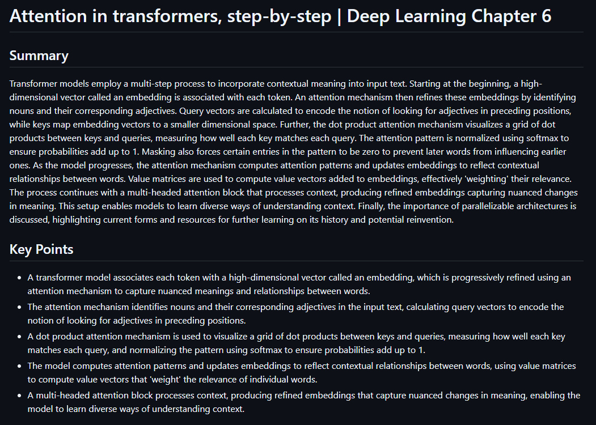

<div align="center">

# yt-summary

**Summarize your YouTube videos readable as text or audio ** 🎥

_A modern, local-first CLI tool to extract transcripts from YouTube and transform them into concise summaries and key points._

[](https://opensource.org/licenses/MIT)

</div>

## ✨ What is yt-summary?

`yt-summary` is a command-line tool that converts YouTube videos into clean Markdown summaries using transcripts and Large Language Models.

Give it a video URL, a playlist, or a file containing multiple URLs, and `yt-summary` will fetch the transcript, summarize the content in manageable chunks, and generate a readable Markdown document with a summary and optional key points.

It's designed to be simple, fast, and automation-friendly, making it easy to extract useful information from long, informational videos.
By default, `yt-summary` is local-first and privacy-friendly when used with Ollama, while still supporting cloud models via LiteLLM or Omniroute proxies.

<p align="center">
  
</p>

## 🚀 Features

- Generate clean Markdown summaries with optional key points.
- Summarize a single video, a playlist, or a batch of URLs.
- Optimized for Small Language Models (SLMs), which are often sufficient for high-quality summarization.
- **Multiple LLM backends**: Ollama (local), LiteLLM, or Omniroute (cloud proxies).
- Multi-language summaries: uses native transcripts when available, with automatic fallback and translation.
- Handles long videos via transcript chunking.
- Skips reprocessing when a summary already exists (with an option to force regeneration).
- **TTS/Audio generation**: Convert summaries to audio using Piper or edge-tts.
- **Email output**: Send summaries directly to email.
- **Telegram notifications**: Receive session statistics via Telegram bot.
- **Think mode**: Enable Ollama's extended thinking for deeper analysis.
- **Session statistics**: Track tokens, words, and processing time.
- **External tracking**: Integrates with yt-dlp download tracking.

## 🧠 How it works

At a high level, `yt-summary` follows a simple pipeline:

1. Resolve the input target (video, playlist, or file).
2. Fetch the YouTube transcript in the requested language, with fallback and translation when needed.
3. Split the transcript into word-based chunks.
4. Summarize each chunk independently.
5. Merge chunk summaries into a coherent narrative.
6. Extract key points from the summary.
7. Output results as Markdown, audio, email, or Telegram notification.

## 📋 Usage

```bash
# Basic usage
./yt-summary "https://youtube.com/watch?v=VIDEO_ID"

# Specify model and summary length
./yt-summary "https://youtube.com/watch?v=VIDEO_ID" llama3.2:3b --length short

# Generate audio from summary
./yt-summary "https://youtube.com/watch?v=VIDEO_ID" --audio

# Send to Telegram
./yt-summary "https://youtube.com/watch?v=VIDEO_ID" --telegram

# Process a playlist (limit to 10 videos)
./yt-summary "https://youtube.com/playlist?list=PLAYLIST_ID" --max-playlist-videos 10

# Force reprocess and include stats
./yt-summary "https://youtube.com/watch?v=VIDEO_ID" --force --stats --include-stats

# Batch process from file
./yt-summary urls.txt --force

# Use LiteLLM backend
./yt-summary "https://youtube.com/watch?v=VIDEO_ID" --backend litellm --litellm-proxy http://localhost:4000

# Enable Ollama think mode
./yt-summary "https://youtube.com/watch?v=VIDEO_ID" --think
```

## 🔧 Configuration

Configure via environment variables or a `.env` file in the same directory as the script.

### LLM Backend Options

```bash
# Ollama (default)
LLM_BACKEND=ollama
OLLAMA_HOST=http://localhost:11434
OLLAMA_MODEL=gemma2:2b
OLLAMA_NUM_CTX=24000

# LiteLLM proxy
LLM_BACKEND=litellm
LITELLM_PROXY_URL=http://localhost:4000
LITELLM_MODEL=gpt-4
LITELLM_API_KEY=sk-...

# Omniroute proxy
LLM_BACKEND=omniroute
OMNIROUTE_URL=http://localhost:20128
OMNIROUTE_MODEL=gpt-4
OMNIROUTE_API_KEY=...
```

### Output Options

```bash
# Summary length: short, medium, long
SUMMARY_LENGTH=medium

# Output language (default). Only applied when --language/TARGET_LANGUAGE is
# NOT set. When no explicit language is requested, per-video audio-language
# detection runs: Romanian audio -> Romanian; any other audio -> English.
 TARGET_LANGUAGE=en

# Chunk size (words)
CHUNK_WORDS=900
```

### Prompt Templates

All prompts are configurable via `PROMPT_SYSTEM_*` and `PROMPT_USER_*` variables.
`*_SYSTEM` prompts take a single-line value; `*_USER` prompts support multi-line
values using heredoc syntax. Each user template supports placeholders that are
replaced at use time:

| Placeholder | Used in template |
|---|---|
| `{{LANG}}` | chunk, aggregate, key points |
| `{{CHUNK_TEXT}}` | chunk |
| `{{CHUNK_CONTEXT}}` | chunk |
| `{{MIN_SUMMARY_WORDS}}` | aggregate |
| `{{LENGTH_GUIDANCE}}` | aggregate |
| `{{CHUNK_SUMMARIES}}` | aggregate, key points |
| `{{MIN_BULLETS}}`, `{{MAX_BULLETS}}` | key points |
| `{{FINAL_SUMMARY}}` | key points |

Templates are:
`PROMPT_SYSTEM_CHUNK`, `PROMPT_USER_CHUNK`, `PROMPT_SYSTEM_AGGREGATE`,
`PROMPT_USER_AGGREGATE`, `PROMPT_SYSTEM_KEYPOINTS`, `PROMPT_USER_KEYPOINTS`.
Leave them unset to use the built-in defaults (see `.env.example`).

```bash
# Single-line system prompt
PROMPT_SYSTEM_CHUNK=You are an expert summarizer...

# Multi-line user prompt (heredoc form)
PROMPT_USER_CHUNK=<<'PROMPT_EOC'
Summarize this transcript chunk in a single coherent paragraph.

Language: {{LANG}}

Transcript:
{{CHUNK_TEXT}}
PROMPT_EOC
```

### TTS/Audio Options

```bash
# TTS engine: piper (default) or edge-tts
TTS_ENGINE=piper

# Audio format: mp3 (default) or m4a
AUDIO_FORMAT=mp3

# Voice (auto-detected from language by default)
AUDIO_VOICE=en-US

# Default voices when no --voice/AUDIO_VOICE is set.
# Piper defaults are filenames in VOICES_DIR (without .onnx).
DEFAULT_VOICE_PIPER_EN=en_GB-alan-medium
DEFAULT_VOICE_PIPER_RO=ro_RO-mihai-medium
# edge-tts defaults are voice names (see: edge-tts --list-voices).
DEFAULT_VOICE_TTS_EN=en-US-EmmaMultilingualNeural
DEFAULT_VOICE_TTS_RO=ro-RO-AlinaNeural
```

### Notification Options

```bash
# Telegram
SEND_TELEGRAM=true
TELEGRAM_BOT_TOKEN=123456:ABC-DEF...
TELEGRAM_CHAT_ID=123456789

# Email (requires sendmail, mail, or mutt)
EMAIL_FROM=noreply@example.com
```

## 🌍 Language Support

Summaries support 12 languages: English, Italian, Spanish, French, German, Portuguese, Japanese, Korean, Chinese, Russian, Romanian, and auto-detected fallback.

## 🔒 Privacy

When using Ollama, all processing happens locally—no data leaves your machine. Cloud backends (LiteLLM, Omniroute) require API keys and send data to external services.

## 📦 Dependencies

### Required
- `yt-dlp` (for transcript fetching)
- `jq` (for JSON processing)
- `curl` (for API requests)
- `ollama` (required only when using the default ollama backend; not needed for LiteLLM or Omniroute)

### Optional
- `python3` + `youtube-transcript-api` (fallback transcript fetch)
- `mail`/`sendmail`/`mutt` (email output)
- `piper-tts` (local TTS, required for TTS with `TTS_ENGINE=piper`)
- `edge-tts` (Microsoft cloud TTS, required for TTS with `TTS_ENGINE=edge-tts`)
- `ffmpeg` (audio format conversion)

## 🛠️ Development

```bash
# Run the main script
./yt-summary <target>

# Show help
./yt-summary --help

# Check transcript extraction
yt-dlp --print title --print description <url>
```

## 📄 License

MIT License - see [LICENSE](LICENSE) for details.
